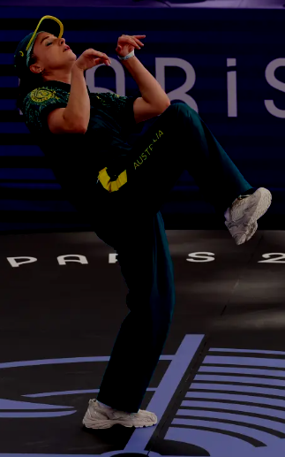
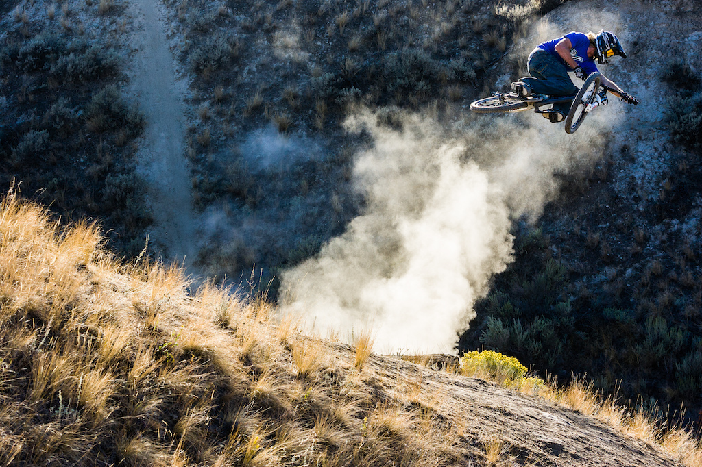
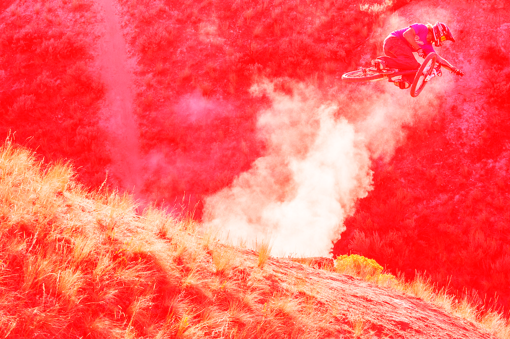
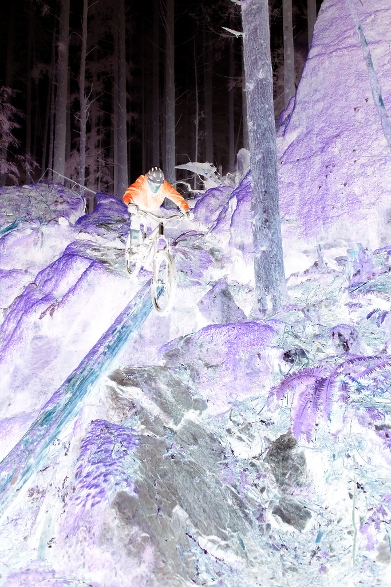
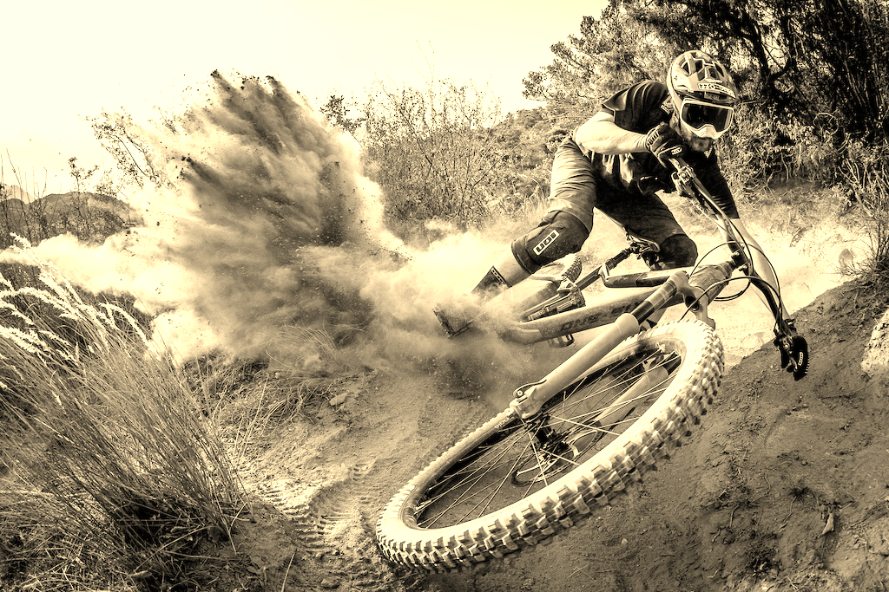
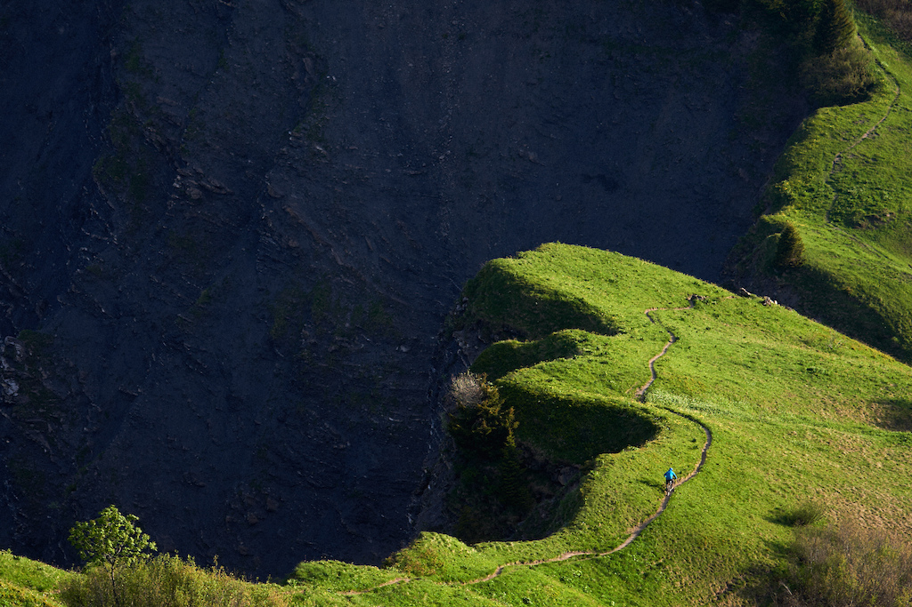
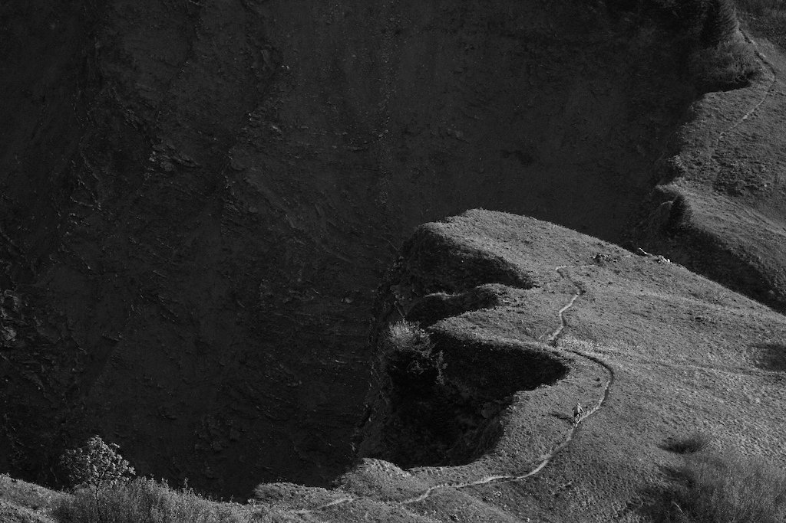
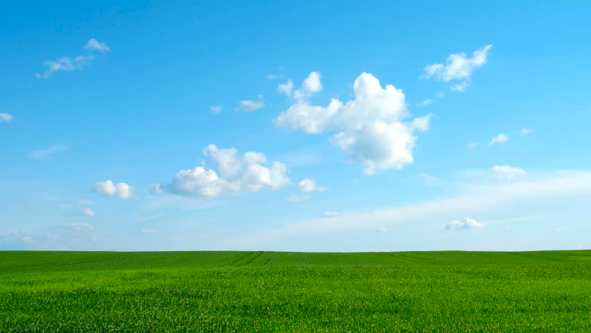
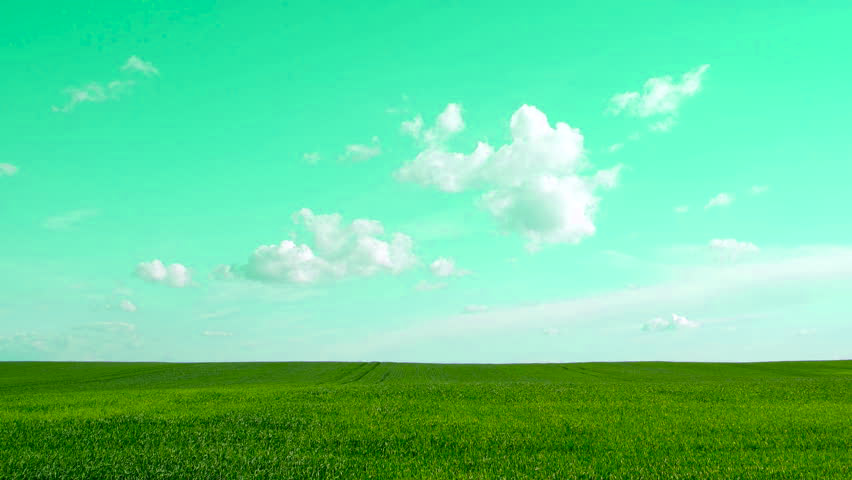

# 4.1-Manipulating-Pixels


### Quick Tutorial: Working with Images in Python Using Pillow

This tutorial introduces some basic functions from the **Pillow** library, a powerful tool for working with images in Python.

[Video Tutorial](https://www.youtube.com/watch?v=15aqFQQVBWU)

### 1. **Image.open()**
- **Purpose**: Opens an image file and loads it into your Python program.
- **Example**:
  ```python
  from PIL import Image
  
  # Open an image file
  image = Image.open("example.png")
  ```
  - The image file `example.png` is now loaded, and you can manipulate it in your code.
  
### 2. **image.load()**
- **Purpose**: Loads the pixel data of the image, giving you access to each pixel's color values (RGB/RGBA). This is useful when you want to read or modify individual pixels.
- **Example**:
  ```python
  pixels = image.load()
  ```
  - `pixels` now holds a pixel access object, which allows you to access and modify pixel values using coordinates `(x, y)`.

### 3. **image.height & image.width**
- **Purpose**: These are attributes of the image object that provide the image's height (number of rows of pixels) and width (number of columns of pixels).
- **Example**:
  ```python
  width = image.width  # Get the width of the image
  height = image.height  # Get the height of the image
  print(f"Width: {width}, Height: {height}")
  ```
  - These give the dimensions of the image, which is useful for looping through pixels or determining how large the image is.

### 4. **pixels[x, y]**
- **Purpose**: Accesses the color values of the pixel at position `(x, y)`. The values returned depend on the mode of the image, such as:
  - **RGB mode**: Returns a tuple of three values (R, G, B) for red, green, and blue components.
  - **RGBA mode**: Returns a tuple of four values (R, G, B, A), where A is the alpha (transparency) value.
- **Example**:
  ```python
  # Access the color of the pixel at coordinates (10, 10)
  r, g, b = pixels[10, 10]
  print(f"Red: {r}, Green: {g}, Blue: {b}")
  
  # Change the pixel at (10, 10) to red
  pixels[10, 10] = (255, 0, 0)
  ```

### 5. **image.save()**
- **Purpose**: Saves the modified image to a file. You can save it in different formats, such as PNG, JPEG, etc.
- **Example**:
  ```python
  # Save the modified image to a new file
  image.save("modified_image.png")
  ```
  - This saves the image with any changes you made to a new file called `modified_image.png`.


Background on Digital Images


 

 

# Manipulating Pixels Assignment

## Functions To Be Written:
### ligthen_darken()
Create a function that can either lighten or darken an image based on an input passed in as an argument. 
```python
def lighten_darken(image_name, difference):
  # your code goes here
```             



### red_filter()
Create a function that applies a red filter to the image. The function only needs to take the image in as a parameter. The red filter works by setting the red value of all pixels to 255 while keeping the green and blue values of each the pixel the same.
```python
def red_filter(image_name):
  # your code goes here
```

### invert()
Create a function that inverts the color values for each channel within each of the pixels. In this new filter, a color channel that was shown at a high intensity will be displayed at a very low intensity and visa versa.
```python
def invert(image_name):
  # your code goes here
```

# sepia()
Create a function that makes a sepia filter. Instagram uses the following to make their sepia filter:
- red = red*.393 + green*0.769 +blue*0.189
- green = red*.349 + green*0.686 +blue*0.168
- blue = red*.272 + green*0.534 +blue*0.131
```python 
def sepia(image_name):
  # your code goes here
```


# black/white()
Create a filter that makes a black and white filter. This can be done by averaging the red, green and blue color channels for each pixel.
```python
def black_white(image_name):
  # your code goes here
```


# blue_to_green()
Create a function that turns objects that appear blue to green. For example, the function that you write should be able to differentiate between the blue pixels in the sky and the blue pixels in the rest of the image like those in the water.
```python
def blue_to_green(image_name):
  #insert your code here
```

 

  

 

 
# Create Your Own Filter
Create your own function that applies a filter to an image.
```python
def your_filter(parameter, parameter):
  # your code goes here
```